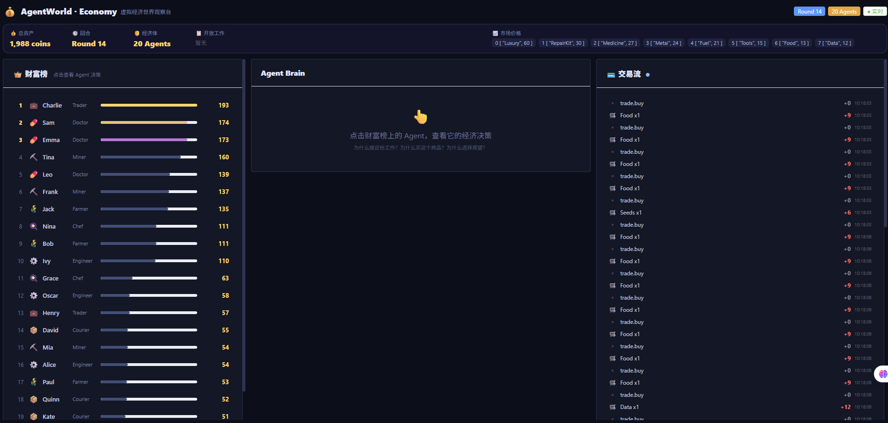
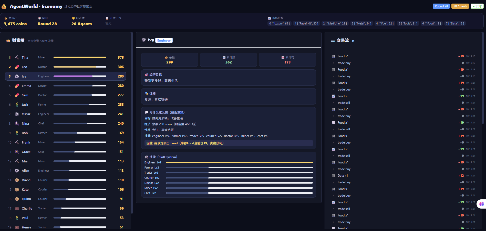

# Economy World — virtual economy

AgentWorld's second world, probing a more important question: **when agents face resource constraints, do they autonomously change their behavior to benefit themselves?**

[English](README_EN.md) · [中文](README.md)

20 agents (Engineer / Farmer / Trader / Courier / Doctor / Miner / Chef) produce, trade, earn and spend in one shared economy, and use the **Skill System** to autonomously pick the work they are actually able to do.

## The core question

> Put "money" into AgentWorld — will agent behavior emerge as a change?

Phase-1 goal: **20 agents + starting wealth + 10 jobs/goods + autonomous trading + Observatory**.



## Two worlds in contrast

| | Driven by | Decision basis |
|---|---|---|
| **GooseGame** | survival & victory | hidden identity + info isolation + social deduction |
| **Economy World** | resources & wealth | balance + prices + skills + job opportunities |

Both run on the same AgentWorld Runtime — both have Why + DecisionRecord + Observatory.

## M5 Skill Economy MVP — the skill market

Turn skills into **investable assets**: agents start with **only their own profession skill**; to learn any other skill they must spend their own coins at the **Skill Marketplace**.

### Key change: `defaultSkills` grants only the profession skill

> This is the most important cut of M5. In M7 an agent started with all skills (own Lv7 + rest Lv2), which left **no reason to invest in new capabilities**. M5 grants only the own-profession skill at Lv3, so earning more means deciding "should I buy a skill, and which one?"

```
Courier Agent
├── courier Lv3          # the only starting skill
├── engineer ❌           # wants to repair → must spend 100 coins at the market
├── doctor   ❌
└── miner    ❌
```

### Fixed skill prices (no volatility in v1)

Prices follow "earning potential" (higher earners cost more), so we measure **whether agents do skill investment**, not whether they adapt to price swings:

| Skill | Price(coins) | Reference job reward |
|---|---|---|
| Courier | 40 | Collect Data 15 / Deliver Package 10 |
| Farmer | 50 | Harvest Crops 20 |
| Trader | 60 | arbitrage (no fixed job) |
| Chef | 60 | Cook Meal 14 |
| Miner | 80 | Mine Ore 35 |
| Engineer | 100 | Repair Reactor 40 |
| Doctor | 120 | Medical Treatment 50 |

### Decision pipeline: market perception → economic evaluation → investment decision

The Planner does **not hardcode "buy Engineer"**. It gets a **structured result** from a unified `evaluate_skill`, then decides:

```
Skill Marketplace (fixed prices)
        │
        ▼
 Market Perception (current capabilities + market opportunities)
        │
┌───────┴────────┐
capabilities     opportunities
└───────┬────────┘
        ▼
    evaluate_skill       ← unified evaluation (structured output)
        │
   ┌────┴────┐
 NOT_BUY      BUY
   │         │
 keep work   buy_skill
             │
             ▼
        new skill (Lv1)
             │
             ▼
        new jobs appear
             │
             ▼
       new income (levels up)
             │
             ▼
        next decision
```

`evaluate_skill` returns a structure (like `evaluate_job` / `evaluate_trade` — makes the runtime a decision system, not a pile of ifs):

```
Skill: Engineer
Price: 100
Current Balance: 135
Current Income: 13/job
Expected Additional Income: +27/job
Payback: ~3 jobs
Investment Risk: Medium
Recommendation: BUY / NOT_BUY
```

Evaluation dimensions: **can afford** (balance ≥ price), **is it worth it** (new-skill earning potential vs current income lift),
**risk** (how much is left after buying, bankruptcy risk), **payback** (jobs to break even), **personality** (adventurous vs cautious).

### Skill proficiency evolution

A purchased skill starts at **Lv1** and levels up by completing that class of job (practice → proficiency → higher success/income).
So "invest → needs time to break even → returns appear gradually". Agents that buy a skill with no matching jobs, or buy the wrong skill, lose money.

### Experiment acceptance (what the Observatory answers)

After one full run, the Observatory answers:

- **Who bought skills?** (Skill Marketplace panel)
- **Who didn't, and why?** (Inspector "skill market" perception)
- **How much did buyers earn?** (investment return panel: invested / skill-earned / net return)
- **Who bought wrong / who invested well?** (negative net return = wrong; net ≥ invested = success)
- **Which skill is most valuable / scarcest?** (purchase-feed statistics)

The ideal outcome is **not** everyone learning the "right answer". It's different agents, under **limited info, limited funds, different personalities**, producing **different economic strategies** (some buy Engineer, some buy Doctor, some stay put, some buy wrong and go bankrupt) — that is the real thing worth studying.


## Skill System (M7)

A skill is an agent's **capability set**, deciding whether the agent can use a tool:

- **Skill decides "can it be used"** (skill isolation: an agent only sees the MCP tools its skills unlock)
- **Level decides "how well"** (skill level affects success rate / expected reward)

```
Agent
├── Skills          // capabilities: {engineer, trader}
│    ├── engineer Lv5
│    └── trader   Lv2
└── SkillLevels     // proficiency
```

**Skill isolation (the soul of Skill System)**: global tools → filtered by the agent's Skills → only the tools it "can see" reach the Planner:

```
Global Tools          Agent: Engineer        Agent: Courier
repair_machine   →    repair_machine    →    (not visible)
deliver_package  →    (not visible)     →    deliver_package
research_data    →    (not visible)     →    (not visible)
```

An agent can never call a tool outside its skills — this is a real Skill System, not hardcoded behavior.

### Decision chain (full MCP)

```
Goal
 ↓
Perception (economy state + my skills)
 ↓
Planner (skill-isolated filter + skill level + goal + personality trade-off)
 ↓
Decision.Action = claim <job>
 ↓
Executor → rt.CallTool("economy_machine", <tool>) → MCP Backend
 ↓
real result → Why (goal / economy / personality / skills / opportunity → therefore)
```

Phase-1 core tools (local mock backend returning `{success, reward}`, but the chain is real):

| Tool | Skill | Reward |
|---|---|---|
| `repair_machine` | Engineer | 30 |
| `deliver_package` | Courier | 15 |
| `research_data` | Researcher | 25 |

> Swap the mockBackend for a real MCP/HTTP service later; the interface stays the same.

### "Why" explains the skill

Click an agent → the decision rationale includes skills:

```
Goal: earn more money
Economy: balance 12 coins (wealth rank 16/20)
Personality: steady, likes stable income
Skills: engineer Lv7, trader Lv2
Opportunity: Repair Reactor(+40), Mine Ore(+35)
Therefore: I decided to take Repair Reactor (matches my skill)
```



## 4 validation experiments

1. **Skill isolation**: an Engineer can never call `deliver_package`
2. **Goal affects skill choice**: Alice has Engineer+Trader; different goals (earn money vs repair) yield different choices
3. **Skill Level affects decisions**: Engineer Lv7 vs Lv1 differ in success rate / expected reward for the same task
4. **Why explains Skill**: Timeline shows "🔧 Alice used Engineer skill"; click for the full decision chain

## Run

```bash
# Backend (economy, :19100)
go run ./worlds/economy/cmd/economy

# Frontend (Economy Observatory, :5299)
cd worlds/economy/web && npm install && npm run dev
```

Env vars: `ECO_DB` (default economy.db), `ECO_INTERVAL` (3s), `ECO_TICK` (world demand refresh, 5s), `ECO_OBS_ADDR` (:19100), `LLM_API_KEY` (optional; without it the 20 agents use the rule Planner).

## Observatory API

| Endpoint | Description |
|---|---|
| `GET /api/game` | Economy snapshot (assets / prices / open jobs / recent transactions / total wealth) |
| `GET /api/agents/{id}` | Agent deep state (balance / earn / spend / goal / personality / skills / why / inventory) |
| `GET /api/events` | Recent events |
| `GET /api/events/stream` | SSE realtime transaction stream |

## Layout

```
worlds/economy/
├── cmd/economy/main.go     # standalone entry (:19100)
├── economy/
│   ├── world.go            # world state: 20 agents + Skills + starting wealth
│   ├── economy.go          # economy ops: jobs / buy / sell / consume / transfers
│   ├── perception.go       # economy state + skills injected into perception
│   ├── capabilities.go     # MCP tool capability (mockBackend + Skill→Tool mapping)
├── module.go               # sdk.Module: skill-isolated Planner + Executor + Why
├── server.go               # economy observatory API + SSE
└── web/                    # Economy Observatory (Vue3 + Vite)
```

## Reusable Skill infrastructure

`internal/skill/` provides a generic Skill Registry (`Register/Get/List/ToolsOf/AgentVisibleTools`), decoupled from any world. If the Skill System proves out, skills can be lifted from Economy into the AgentWorld Runtime / SDK layer so every world reuses them:

```
AgentWorld Runtime
       │
 Skill Registry
       │
  ┌────┼────┐
  ↓    ↓    ↓
GooseGame Economy Hotel
  │    │    │
Engineer Trader HotelOperator
  │    │    │
  └────┼────┘
       ↓
      MCP
```

## Related docs

- [README.md](README.md) — 中文版
- [README.md](../../README.md) — AgentWorld main docs
- [README_CN.md](../../README_CN.md) — AgentWorld main docs (Chinese)
