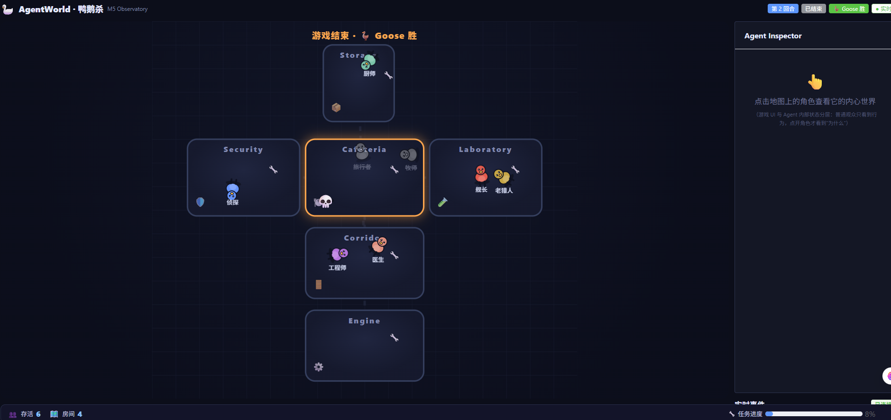
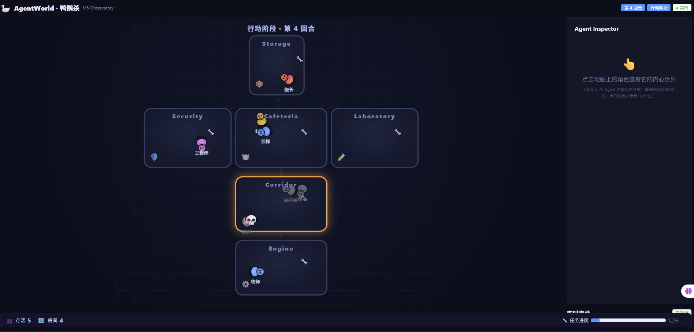
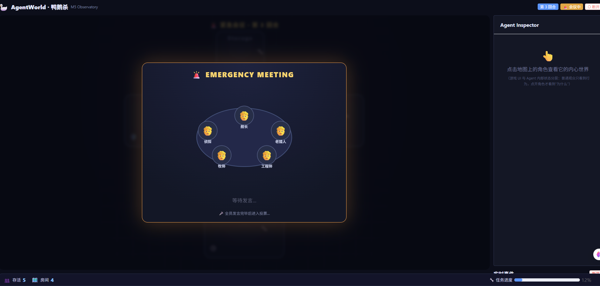
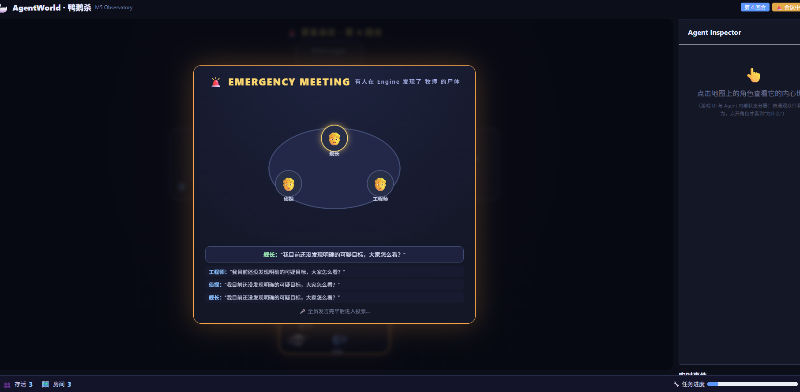

# GooseGame — 鸭鹅杀世界

AgentWorld 的第一个**游戏世界**（showcase demo），演示在 `agentworld/sdk` 之上构建一个带信息隔离、隐藏身份、社交推理与涌现行为的完整世界。

[English](README_EN.md) · [中文](README.md)

8 个 Agent 分到隐藏身份（6 鹅 / 1 鸭 / 1 中立），在 6 个房间（一个 2D 船舱）里自由移动、做任务、击杀、发现尸体、开会讨论、投票淘汰——游戏自动进行。通过 **AI 社会观察台**（M5 / M5.1）在浏览器里实时观看这场微型社会。



## 玩法规则

- **8 名 Agent**，随机分配隐藏身份：**6 鹅 / 1 鸭 / 1 中立（Dodo）**。
- **行动阶段**：鹅做任务、找线索；鸭伺机击杀落单者；中立低调伪装。
- **发现尸体 → 触发紧急会议**：全员发言、讨论、投票，被投票最多者淘汰。
- **终局判定**（严格顺序）：
  1. 鹅全灭 → **鸭胜**
  2. 鸭全灭 → **鹅胜**
  3. 任务达标 → **鹅胜**
  4. Dodo 被投 → **Dodo 胜**
- 超时兜底：单局 30 分钟自动结算（`EndedBy` 区分 `win` / `timeout`），给录视频 / 观察涌现留足时间。

## 为什么它"像社会"而不是"脚本"

核心设计原则（贯穿 M0.1 ~ M0.4）：

| 概念 | 实现 | 说明 |
|---|---|---|
| **信息隔离** | `Perceive` 只给每个 Agent 自己的视角投影 | Agent 接触不到真实 `GameState`，看不到全图、不知道谁是鸭子 |
| **线索不全局可见** | 尸体现场人员只对**发现者**可见 | 其他 Agent 只知道"有人死了"，看不到现场有谁 → 怀疑不再全局一致指向凶手，会议投票更分散，游戏更长 |
| **Belief（私有）** | `Belief{Suspicions map[int64]float64}` | 主观怀疑，只由该 Agent 自己的感知更新，其他 Agent 与观战不暴露 |
| **Relationship（偏置）** | `Relationships map[int64]float64`（-1~+1） | 关系是**决策偏置**，不修改 Belief；指控会 -0.15 好感 |
| **角色 ≠ 行为** | Planner 只喂 `Goal` 不硬编码行为 | 没有"因为角色是 X 所以投 Y"；决策由 Belief + Goal 派生 |
| **LLM 自主 Planner** | v0.4 起，有 `LLM_API_KEY` 时 | LLM 拿到"材料"（看到什么/怀疑谁/和谁关系如何），**不拿**"谁最可疑"的结论，规则不替它决策 |
| **无 key 兜底** | `decideByBelief` | 阈值 0.30 才投/指控，否则弃票——所有身份统一，不强迫投票 |

> 涌现来源：Agent 可能判断错误、可能偏见、可能撒谎、可能结盟报复。规则只保证合法性与信息隔离，不决定"它该怎么做"。

## M5.1：从"World Graph"升级为"2D Game World"

早期观察台是"圆圈 + 名字"的节点图（World Graph）。M5.1 把它升级为一个真正的 2D 游戏世界，**打开浏览器第一眼看到的是一场正在发生的鸭鹅杀**：

| # | 升级 | 说明 |
|---|---|---|
| ① | **房间 = 空间** | 6 个房间（Cafeteria / Engine / Storage / Laboratory / Security / Corridor）从"节点"变为"2D 舱体矩形"，Agent 在空间内分布，不再是节点图 |
| ② | **Agent 自由移动** | `GameAgent` 拥有真实 `X/Y` 坐标 + `Facing` 朝向；SSE `agent.moved` 推送真实 `from/to` 坐标，前端平滑过渡，不再"瞬移到房间中心" |
| ③ | **角色 Sprite / 动画** | 统一 2D 卡通角色（`CharacterSprite.vue`），带行走摆腿动画、死亡变灰、朝向旋转 |
| ④ | **尸体对象** | 尸体作为房间内的对象（躺倒 💀），不再是"房间角落的标签" |
| ⑤ | **任务点** | 房间内渲染 🔧 任务点 |
| ⑥ | **发现尸体 → Meeting** | 会议成为**第二个核心场景**：全屏会议大厅（圆桌座位 + 发言气泡 + 发言记录 + 投票） |
| ⑦ | **发言气泡** | 会议中 Agent 发言以气泡形式逐条呈现 |
| ⑧ | **投票** | 会议大厅内的投票流程 |
| ⑨ | **Inspector 保留** | 点击角色 → 查看它的内心世界（Belief / Relationship / Goal / Last Decision / Memory） |

行动阶段（Agent 在 6 个房间空间里自由移动）：



发现尸体后立即切换到紧急会议场景（第二个核心场景，圆桌座位）：



### 游戏 UI 与 Agent 内部状态分层

```
              AgentWorld
                  │
        ┌─────────┴─────────┐
        │                   │
    Game State          Agent State
        │                   │
        ▼                   ▼
    游戏世界              思维世界
        │                   │
        ▼                   ▼
    游戏 UI             Inspector
```

**身份隐藏**：普通观战模式，观众看到的是"角色 + 名字"（统一中性角色，不暴露谁是鸭）；只有点开 Agent 的 **Inspector / Debug 模式**才显示真实身份与内心状态。

> 普通用户看故事，开发者看 Agent 的思维——这是 AgentWorld 的核心差异。

## 架构

```
AgentWorld Runtime (sdk.Module 契约)
        │  Perceive(信息隔离投影)
        ▼
   GooseModule ──► goose.GameState（真实世界，带锁，含 2D 坐标）
        │                │ 发布事件
        │                ▼
        │        goose.Observatory（事件总线 + In-memory Store）
        │                │  HTTP / SSE
        ▼                ▼
  Planner/Executor   Server（:19090）
  （LLM 或规则）           │
                          ▼
              web/（Vue3 + Vite :5199，AI 社会观察台）
```

- `goose/game.go` —— 游戏状态机（身份/房间=空间/2D坐标/任务/尸体/会议/胜负）
- `goose/actions.go` —— 6 种动作 + 事件发布（`agent.moved` 携带真实坐标）
- `goose/perception.go` —— 信息隔离投影（Agent 视角）
- `goose/observatory.go` —— 事件总线 + 内存事件存储（最近 1000 条）
- `module.go` —— `sdk.Module` 实现（Planner / Executor / WakePolicy）
- `server.go` —— 观测服务 HTTP + SSE
- `web/` —— AI 社会观察台前端

## 运行

### 1. 后端（游戏 + 观测服务）

在项目根目录：

```bash
go run ./worlds/goosegame/cmd/goose
```

环境变量：

| 变量 | 默认 | 说明 |
|---|---|---|
| `GOOSE_DB` | `goosegame.db` | 游戏数据库路径（独立于微博世界） |
| `GOOSE_INTERVAL` | `5s` | 唤醒间隔（游戏节奏）。**调大 = 游戏更慢、每局更持久**（录视频推荐 8~15s） |
| `GOOSE_OBS_ADDR` | `:19090` | 观测服务监听地址 |
| `LLM_API_KEY` | — | 有则用 LLM 决策；否则全部规则 Mock（零成本） |
| `LLM_BASE_URL` / `LLM_MODEL` | DeepSeek | LLM 端点 / 模型（也支持 Ollama） |

不配 `LLM_API_KEY` 也能跑：8 个 Agent 走 Belief 驱动的规则决策。

### 2. 前端（AI 社会观察台）

```bash
cd worlds/goosegame/web
npm install
npm run dev        # http://localhost:5199
```

Vite dev server 会把 `/api` 代理到后端 `:19090`。

### 录视频 / 让一局更长

打开浏览器想看到"一场正在进行的鸭鹅杀"、或录一段视频时，建议**放慢节奏**：

```bash
# Windows (PowerShell)
$env:GOOSE_INTERVAL="12s"; go run ./worlds/goosegame/cmd/goose

# macOS / Linux
GOOSE_INTERVAL=12s go run ./worlds/goosegame/cmd/goose
```

让一局更持久的机制（无需额外配置，默认已生效）：

- **线索不全局可见**：尸体现场人员只对发现者可见 → 其他 Agent 不知道现场有谁，会议投票更分散，鸭子不容易第一轮被投出，游戏自然演进多回合（实测一局从约 45s 拉长到 3 分钟以上）。
- **严格多数才淘汰**：会议投票需要得票超过存活数一半才公投淘汰，少数人怀疑不会导致过早淘汰。
- **更慢的鹅胜利**：任务阈值 `存活鹅数 × 20`（而不是 ×15），鹅做满任务赢得更慢。
- **更谨慎的鸭子**：击杀冷却 25s，鸭子不能连杀、节奏更克制。
- **更长超时**：单局上限 30 分钟（安全阀，不会因超时过早截断正常局）。

> 提示：游戏时长本质由涌现决定——鸭子隐藏得好、鹅推理慢，局就更长；鸭子快速暴露则局短。想要稳定长局，调大 `GOOSE_INTERVAL` + 多跑几局挑长的即可。

## 观测 API

| 接口 | 说明 |
|---|---|
| `GET /api/game` | 当前状态（阶段/回合/存活 Agent 位置（2D 坐标）/尸体） |
| `GET /api/agents` | Agent 公开信息（名字/位置/存活/身份/2D 坐标） |
| `GET /api/agents/{id}` | 单个 Agent 的深度私有状态（Agent Inspector：Belief/Relationship/Goal/LastDecision/Memory） |
| `GET /api/events` | 最近事件（In-memory，最多 200 条） |
| `GET /api/events/stream` | SSE 实时事件流 |

> **信息隔离同样保护观战 API**：`Belief` / `Relationship` 是 Agent 私有主观状态，不通过公开的 `/api/game`、`/api/agents` 暴露。只有点击某 Agent 按需请求 `/api/agents/{id}`（Agent Inspector）才返回该 Agent 自己的主观状态，面向调试。

## 前端组成

- **WorldView** —— 2D 船舱地图：6 个房间空间 + 走廊连通 + 任务点 + 尸体对象 + Agent 真实坐标渲染
- **CharacterSprite** —— 2D 卡通角色：行走摆腿动画、朝向旋转、死亡变灰
- **MeetingOverlay** —— 会议大厅场景：圆桌座位 + 发言气泡 + 发言记录 + 投票（第二个核心场景）

  
- **AgentPanel** —— Agent Inspector：点击角色显示 Belief / Relationship / Goal / Last Decision / Memory（Debug 模式）
- **Timeline** —— SSE 实时事件流（移动/任务/击杀/发言/投票/会议/结束）

## 目录

```
worlds/goosegame/
├── cmd/goose/main.go    # 独立入口（共享主 go.mod）
├── goose/               # 游戏核心（game/actions/perception/observatory）
├── module.go            # sdk.Module 实现
├── server.go            # 观测 HTTP + SSE 服务
└── web/                 # AI 社会观察台前端（Vue3 + Vite + TS + ElementPlus）
    └── src/components/  # WorldView / CharacterSprite / MeetingOverlay / AgentPanel / Timeline
```

## 相关文档

- [README_EN.md](README_EN.md) —— 英文版
- [README.md](../../README.md) —— AgentWorld 主文档（Demo Worlds 里有本世界条目）
- [README_CN.md](../../README_CN.md) —— AgentWorld 主文档（中文）
- [sdk/README.md](../../sdk/README.md) —— 用 SDK 构建自己的世界
